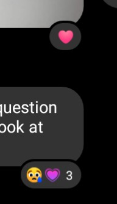

# Messenger Heart Reactions

Use different heart reactions on Facebook Messenger. Specifically, "heart-eyes", "red heart", and "growing heart". The script prompts the user for an integer from 1-3 corresponding to these whenever trying to react with the heart emoji to a message. Note that this script is only applicable to the web version of Facebook Messenger. I.e., it cannot be used in the mobile application.

## How

When reacting to a message, the browser sends an XHR request to the Messenger GraphQL API, and part of this request is simply the Unicode emoji, URI encoded. By modifying this request, we can easily send arbitrary reactions. Unfortunately, this only seems to work (despite exact same responses from the API) with emoji that are or have been "official" reactions, including the 3 different heart reactions. Presumably they keep the old ones around for outdated clients.

## Why

Because I like flexing on people.

## Requirements
Installation of this requires a userscript manager such as [Tampermonkey](https://www.tampermonkey.net/), or a browser that natively supports userscripts.

Tampermonkey is available for most major browsers including [Firefox](https://addons.mozilla.org/en-US/firefox/addon/tampermonkey/) and [Chrome](https://chrome.google.com/webstore/detail/tampermonkey/dhdgffkkebhmkfjojejmpbldmpobfkfo?hl=en).

## Installation
After installing Tampermonkey (see above) or another userscript manager, get the script [here](https://raw.githubusercontent.com/zaxutic/USYD-Timetable-Colours/master/index.user.js).

Most userscript managers should recognise the file as a userscript and open the installation page for you, otherwise you will have to manually add it into your manager.

## Screenshots

### Desktop (Web)

### Mobile

Why are they different on mobile (heart-eyes is the same as desktop)

