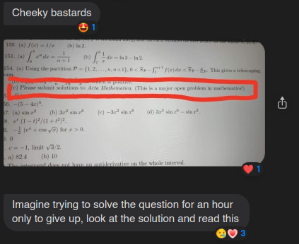
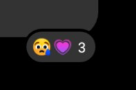

# Messenger Heart Reactions

Use different heart reactions on Facebook Messenger. Specifically, "heart-eyes", "heart", and "growing heart". The script prompts the user for an integer from 1-3 corresponding to these whenever trying to react with the heart emoji to a message.

## How

When reacting to a message, the browser sends an XHR request to the Messenger GraphQL API, and part of this request is simply the Unicode emoji, URI encoded. By modifying this request, we can easily send arbitrary reactions. Unfortunately, this only seems to work (despite exact same responses from the API) with emoji that are or have been "official" reactions, which includes the 3 different heart reactions. Presumably they keep the old ones around for outdated clients.

## Why

Because I like flexing on people.

## Screenshots

### Desktop (Web)

### Mobile

Why is it different on mobile (the other two are the same as desktop)

